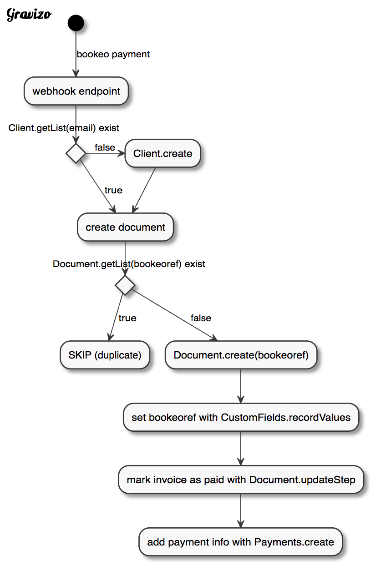

# react-gravizo

[![npm package][npm-badge]][npm]

Generates Graphviz schemas from source code with [gravizo.com](http://gravizo.com/)

Support DOT, PlantUML or UMLGraph formats.

This renders static images, generated via gravizo.com backend with a free anonymous plan.

Demo : https://codesandbox.io/s/42n35on6n7

## Usage

To generate this image :



Use this example :

```js
const Gravizo = require('react-gravizo');

const uml=`
@startuml;
(*) -->[bookeo payment] "webhook endpoint";

--> if "Client.getList(email) exist" then;
-->[true] "create document";
else;
->[false] "Client.create";
--> "create document";
endif;

--> if "Document.getList(bookeoref) exist" then;
-->[true] "SKIP (duplicate)";
else;
-->[false] "Document.create(bookeoref)";
--> "set bookeoref with CustomFields.recordValues";
--> "mark invoice as paid with Document.updateStep";
--> "add payment info with Payments.create";
endif;

@enduml
`

const Demo = () => <Gravizo graph={uml} width={400}/>
```

See also [demo](http://revolunet.github.io/react-gravizo)

[npm-badge]: https://img.shields.io/npm/v/react-gravizo.png?style=flat-square
[npm]: https://www.npmjs.org/package/react-gravizo

